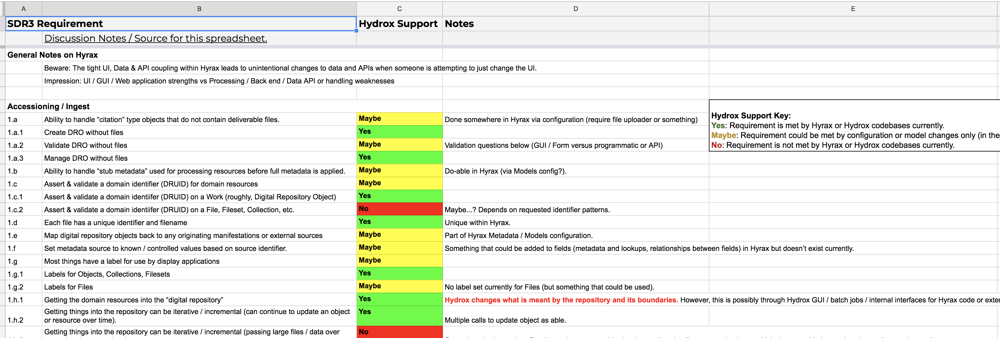

# Hyrax Assessment for TACO Truck Deposit & Administration

*We are actively writing up a blogpost that is a better representation, with more detail, of the information below. That will be linked here when it is published.*

When restarting SDR3, which became TACO Truck, we had just spent a number of years working on projects that we had thought would be able to fill in some of the changes and gaps we wanted for moving our digital repository forward. The main two we had expected to use were [Fedora 4 (the implementation)](Fedora-Asessment.html) and Hyrax. However, as we revisited [our baseline functional requirements](TACO-Truck.html#baseline-functional-requirements), and [built a cross-department shared understanding of what are current system does](TACO-Truck.html#sdr-current-state), we had new information and eyes to revisit these projects and evaluate their utility for our needs and system.

As part of this, in January 2018, we evaluated Hyrax. We had not started our [TACO Prototype by this point](TACO-Prototype.html) yet, so this is purely based on the [TACO functional requirements](TACO-Truck.html#baseline-functional-requirements) gathered in the restart design phase.

Three notes before diving in:
* Use our [Glossary](Glossary.html) for any uncertainty on the parade of acronyms and names about to be used;
* This was performed nearly 7 months ago, so there may are updates or changes to Hyrax and [COCINA](COCINA.html) not reflected (yet) in these findings.
* This is an evaluation based only on our baseline functional requirements as an institution with a large digital repository supporting many, many different needs and user groups.

## Starting Point

Before kicking off TACO Truck prototyping, we expected there are three approaches for Hyrax integration into the project:

1. *Do not use Hyrax at all.* This was considered not ideal, as we do want to find a way to keep attached to parts of the work in that project and we definitely want to remain an active part of the Samvera Community.
2. *Use Hyrax for TACO Truck in its entirety (the complete system).* This was considered untenable; see the Requirements mapping exercise below.
3. *Integrate Hyrax later for a subset of TACO Truck components.* Discussed more below, and dependent on seams in the Hyrax codebase (current or future).

## Requirements to Hyrax Mapping

We started by taking the requirements we gathered in our TACO functional requirements, mapping them to a spreadsheet, then proceeding to evaluate if Hyrax could serve the need either 1. Out of the box ; 2. With configuration or model changes only; or 3. No. Noted here: if it required feature development, whether easy or not to write that, we considered that a No.

From that requirements mapping, we found the following:
* ~38% of our baseline, functional requirements are not covered by Hyrax.
* ~24% of those requirements require changes that are a maybe - i.e., they are not out of the box, but the *should* be configuration or model changes only.
* The most alignment of requirements to existing features is with UI of Self Deposit web application.
* The least alignment of requirements to existing features is with overall architectural considerations, batch processing, and back end needs.

## Possible Hyrax to TACO Seams

* Valkyrie's "internal air gap": not an architectural shift but persistence switching that could be used in the service of architectural shifts. Largely orthogonal work to the questions we are trying to answer currently for TACO Truck.
* Actor Stack, Sipity, & Delayed Jobs: Proposed was writing a Hyrax MiddlewareStack that could serve as a seam to TACO Truck Back end (SOPA to TACO API). (We know that the community direction of Hyrax development has moved away from parts of this, but they are left here as ideas generated at the time of the original evaluation).
* Rely on both internal "air gaps" as well as clean, forced boundaries via APIs if feasible with Hyrax in 1-2 years:
  * This gives us independent scalability;
  * It allows us a migration "hinge" for components that can't or shouldn't fit into Hyrax;
  * Keeps separate the areas we are the most aligned with Samvera on (Self Deposit web applications) from the areas we are the least aligned on (overall architecture, batch processing, etc.).

## Future Steps

We are now in a holding pattern on further Hyrax integration steps until we feel more confident about TACO Truck. We will try to put information here as things come up. 
