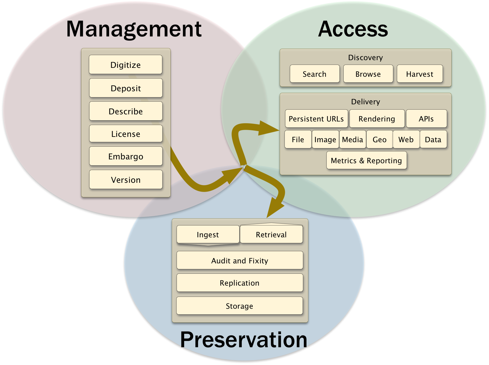
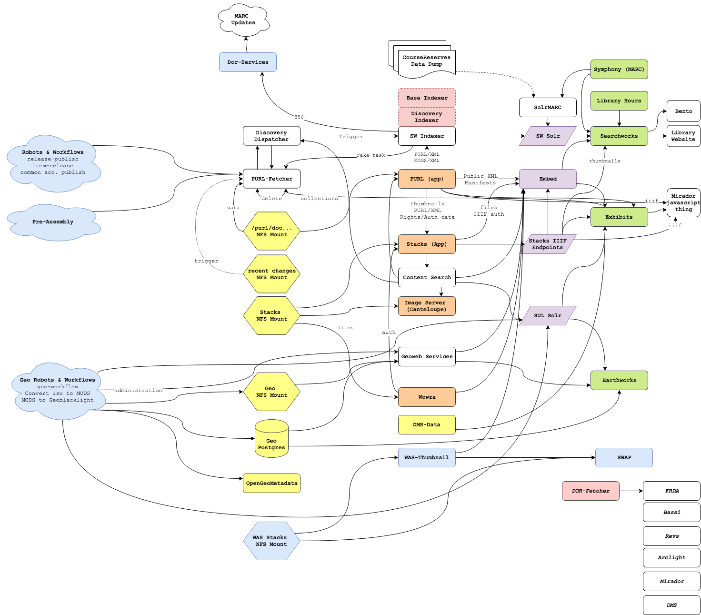

# TACO Truck

TACO Truck is an umbrella term for Stanford Libraries' prototype and implementation of COCINA. This was formerly called SDR3 (standing for the third iteration of the Stanford Digital Repository). We've moved away from the term SDR3, as there won't be a clear cut-over between systems (i.e. we won't just turn off SDR2, turn on SDR3, and be done). In fact, TACO Truck emerged from needing something that could be replaced piecemeal, and the implementation is part maintenance of existing components we know we'll be keeping, part prototype of the components we know we need to replace.

One of the biggest disconnects we had when working on earlier iterations of a possible new architecture (such as Hyrax, Hyku, or Fedora 4 early work) was an understanding what our current system does and what new systems would replace or extend. This disconnect was largely due to the complexity of our current system, how it grew over a decade with many different people involved, and knowledge/experience silos within our teams (i.e. Hydra-mainly developers and SDR2-mainly developers). To address this, the following areas of work were involved:
* We performed a [SDR domain](#taco-truck-domain) & [baseline functional requirements analysis](#baseline-functional-requirements) with a cross-teams design group.
* This was paired with a [SDR2 Current State exercise](#sdr-current-state), to understand how our current infrastructure & codebases map to our high level designs.
* We also performed a [DLSS-wide retrospective on SDR2](#sdr2-department-wide-retrospective), to understand what pain points & technology needs we should prioritize. This gave us updated and better TACO Truck & COCINA Goals.
* Based on the above, [we then assessed existing technologies - Hyrax, Fedora 4, Fedora API, Valkyrie - for our needs](#community-overlaps).
* We [prototyped the core components of COCINA, namely TACO (our repository back-end service)](TACO-Prototype.html).
* And we created a high level [TACO Truck roadmap and migration plan](#taco-truck-roadmap--migration-plans).

All of these above points are represented below, with more information on that work.

### TACO Truck Domain

We first performed a conceptual exercise to understand what the domain of SDR is and what we were trying to re-design (and why). We generated this definition of our domain:

> Digital repository system, based on SUL’s needs, that ingests, processes, enhances, manages, stores, and provisions non-preservation online/digital objects, namely, some grouping of binaries with contextual information (both provided by users and generated by the system). Basically, the infrastructure that makes information available for administration and for all of our digital library preservation and public-facing delivery, discovery and access services. The edges of SDR3 are flexible, but interfaces (used broadly) of the domain’s data is in scope.

It is important to note here the general topology of our current system:

This loosely guided our architecture and implementations for SDR2. There are meant to be (i.e. they are designed but not necessarily implemented) hard interface gaps between Management - our administration, ingest, and repository processing applications; preservation - our homegrown, long-term digital preservation framework that takes MOAB resources from our management layer and preserves them; and access - our files and metadata for discovery and delivery through our online catalog, user collection applications like our instance of Spotlight, a persistent URL resolver for each object and collection, and APIs for retrieval of publicly accessible metadata and assets.

Given this separation, we scoped the domain of TACO Truck to primarily that Management layer, including the interfaces to Preservation and Access. One reason for including the interfaces is that our current implementation of this architecture does not respect these spheres, meaning the system can be extremely hard to debug or extend and test fully. Additionally, changes in Management expectations will then effect downstream systems in, we hope, positive ways - clearer data models that are shared system-wide; cleaner, less coupled data hand-offs, etc. We go into this more below.

For us, however, it means that TACO Truck does include:
* Storage & management system that interfaces with (or provisions to) other systems (preservation, discovery).
* Data administration and ingest / feeder components to our system.

And TACO Truck here does not include:
* Preservation Functions;
* Access & Discovery Systems.

### Baseline Functional Requirements

Before diving further into what we have, it is worth showing our work understanding SDR2 in terms of what baseline requirements are currently served. when we say baseline requirements, we mean what we know SDR2 currently does within our scoped domain definition. This is not every requirement for all users of SDR2, and it definitely is not a comprehensive list of requests and improvements coming from use cases or user stories. Instead, this was an exercise for the cross-department design team to build a common understanding of what SDR2 currently does so that TACO Truck would remain at functional parity. As we continue work on TACO Truck, we are currently lining up meetings with key stakeholder groups to enrich and expand this set of requirements.

You can see a backlog of the requirements as Github tickets here: https://waffle.io/sul-dlss/taco-truck This Waffle board is a work in progress as we clean-up and migrate over the requirements and discussion notes that we generated originally here: https://docs.google.com/document/d/186XkuL_gpd6mhCss9-PC8LofqSNuD7E-Q24wBZIVb4Y/edit.

Additionally, this work generated a [Glossary](Glossary.html) of the terms we use in this project for consistency sake; and documentation on aspects like [what does "delete" mean within SDR (past, present, or future)](https://docs.google.com/document/d/1zBr93MRg8wJUE7QMpOkWB8R6XWWfEkiUUz_o2T6FIC4/edit).

### SDR Current State

Current State was a small working group to explore, explain, document, and improve shared understanding of the current state of the SDR2. The goal was to start with all the places where a resource (metadata and possibly some sort of digital asset) would enter SDR then follow it through all the machines, codebases, scripts, databases, etc. until it ended up in Preservation and in our discovery layers. This was taking what we learned above and then see how it is currently implemented, and was sorely needed work given the complexity and size of our digital repository system implementation.

Before jumping into what we found there, it is worth calling out what SDR currently involves. Here are some facts:

* We have around 1,618,552 resources (collections, items ["work" not file level abstraction], and related administrative objects) currently in our repository.
* We keep all SDR resource metadata in Fedora 3. Digital assets are kept in an NFS mount called "workspace" until they are confirmed to be in Preservation and in Access, then they are cleared out from the repository. This is purely a cost-saving function, as Preservation holds ~455 TB of digital assets currently, Access holds ~426 TB of digital assets, and we have hundreds of TBs of digital assets on our ingest backlog.
* Not all resources are preserved, and not all resources are publicly discoverable / accessible. We currently have ~248,232 items that are 'dark' - i.e. preserved but not served up for public access. Many derivative files for access usage only are not preserved.
* There are at least 5 primary ingest points used by a wide variety of users (see more about each below).
* SDR spans many different content types:
    * images (archival assets)
    * PDFs (ETDs, Google Books, self-deposit uploads, ...)
    * datasets
    * maps & atlases
    * web archiving materials
    * streaming media
    * etc.

Whereas some places may have multiple systems to deal with each bucket of content or users separately, SDR is the single, core system of a lot of divergent needs, materials, workflows, and user groups. This makes understanding our current system en toto vital but at times difficult. To break this up for the Current State review group, we started by breaking apart the key codebases involved and grouping them roughly according to function:

**Ingest**

This is how content gets into  most important ingest components are:
* [Hydrus](https://github.com/sul-dlss/hydrus) is our primary self-deposit app, used for institutional repository, cultural heritage, free online resource cataloging, and other ingest. It is 6 years old, and started with hydra-head 4.0.0, so is an early Hydra application.
* [ETDs](https://github.com/sul-dlss/hydra_etd) (fyi, private repository) is, loosely, a self-deposit application primarily for managing approval and submission of ETDs to the registrar and SDR concurrently. It is nearly 10 years old, and is considered a "proto-hydra" application in that the structure of this codebase influenced early Hydra work.
* [Pre-Assembly](https://github.com/sul-dlss/pre-assembly) is a set of Ruby scripts used heavily by the DLSS Accessioning team to do bulk ingest and curated deposit. It is 6 years old and interacts heavily with our "workflows and robots framework", a combination of a resource state machine and declarative-workflow-driven asynchronous processing framework. The majority of our materials - from our various digitization labs or other sources - enters SDR through Pre-Assembly.
* [WAS-Registrar](https://github.com/sul-dlss/was-registrar) is a Rails application for ingesting archived websites. It is relatively new, being 4 years old, and is one step in mostly manual process for loading web archiving assets into SDR.
* [Argo](https://github.com/sul-dlss/argo) is a special mention here, as it is primarily an administration dashboard for resources in SDR (see more below). Through some additional codebases, it allows bulk editing of metadata through CSV upload.

Many of these ingest points connect to Fedora 3 through ActiveFedora, Dor-Services(-App) and connect to Dor-Workflow-Service for processing (discussed below).

There were a number of pseudo-data-flow type diagrams made to understand what these codebases were doing when someone kicked off an ingest, and this work provided the starting interfaces and data shapes for the next review group. Here are two examples:

*Hydrus Current State "Dataflows"*

*Pre-assembly Current State "Dataflows"*

*WAS Registrar (web archiving) "Dataflow"*

**DOR Services**

DOR (or Digital Object Registry), and is the heart of the "Management" sphere (besides the later addition of Robots & Workflows, below). A good portion of the code here is about negotiating incoming resources, mapping them to our Fedora 3-based data models, loading the metadata into Fedora 3 and the digital assets into the workspace, and kicking off or checking the state of resources in our workflows and robots framework.

* [DOR-Services](http://github.com/sul-dlss/dor-services) is a Ruby gem containing the logic for our repository objects - metadata expectations, writes to Fedora 3 using ActiveFedora, moving files to our NFS mount workspace (where they are removed from once the resource is preserved and accessible), connection to "services" for getting MARC metadata to convert to MODS/XML or generate technical metadata, and hand offs to our workflow service (see below). DOR Services is both the brain and the junk drawer of the repository.

* [DOR-Services-App](http://github.com/sul-dlss/dor-services-app) is a Rails app to primarily (but not only) serve up DOR-Services gem functionalities at REST endpoints. It also brokers connections (in theory) to a lot of our more protected applications, like connections to our Preservation system. The original architectural idea here was to allow any applications needing DOR-Services logic to connect either via REST endpoint or using the gem and appropriate configs to access Fedora, workspace NFS, or other resources. This flexibility has, unfortunately, along with aliasing of many VMs to the one running this service for sake of NFS mounts access, made it extremely hard to debug and extend consistently.

* [SURI](https://github.com/sul-dlss/suri2) is an early Java application that mints domain identifiers for the system. It keeps an Oracle table of minted namespaces and identifiers to avoid collision. While set up to manage multiple namespaces, we only really use one - DRUIDs, which are the SDR object identifiers.

* DOR Fedora 3 Instance is our primary metadata store for all resources in the digital repository. It does not contain digital assets (those are managed in the Workspace NFS Mount). We were heavily guided in our data modeling and metadata practices in SDR2. As such, our Fedora 3 instance contains metadata for both purely administrative objects and our assets, and our Fedora data model has the following datastreams:
    * `DC`: Dublin Core Record for this object, text/xml. We are uncertain who uses this (that couldn't use another stream), so are looking at possibly removing this stream.
    * `RELS-EXT`: Fedora Object-to-Object Relationship Metadata, application/rdf+xml. We use Item Types and RELS-Ext in special ways with our 'virtualized objects', or metadata that stands in for some resource that could appear in a complex resource.
    * `identityMetadata`: Identity Metadata, text/xml.
    * `workflows`: Workflow history (see DOR Workflow Services, below), application/xml
    * `workflow`: Datastream used to manage special workflows (like Google books) process steps, text/xml
    * `readers`: Datastream used to manage ETD readers (who needs to approve them before publication), text/xml
    * `descMetadata`: Descriptive Metadata (in which we try to use MODS), text/xml
    * `rightsMetadata`: Rights Metadata including information if the resource should be published and preserved, text/xml
    * `contentMetadata`: Content Metadata primarily about the digital assets related to the resource, text/xml
    * `technicalMetadata`: Technical Metadata which is minimal and either provided or coming from JHove output in one of the workflow steps, text/xml
    * `provenanceMetadata`: Provenance Metadata, text/xml
    * `versionMetadata`: Version Metadata tracks when a new Version of an object was cut and why, text/xml
    * `events`: Events is a more expansive version of Provenance, text/xml
    * `embargoMetadata`: If there is an embargo on the object, this stream is used to copy over publication information to rightsMetadata until the appropriate date, text/xml

* [DOR-Workflow-Service](https://github.com/sul-dlss/dor-workflow-service) is a Ruby client for interacting with the REST API for Workflow-Service (below). This is used by many of the above applications - ingest as well as DOR-Services-* - to kick off state management and asynchronous processing for our digital repository objects by providing the DRUID of the object and the starting workflow and step.

* [Workflow-Service](https://github.com/sul-dlss/workflow-service) is a Java service that creates a REST endpoint for the workflow service system. Using the DOR-Workflow-Service client above, or calling the endpoint directly, clients can start and check the status of a digital repository resource being processed. Workflow-Service writes metadata about each object, it's starting state, and its starting workflow (including the steps and their order and prerequisites) into a single Oracle table. This is the service then checked by Robot-Master (see below) for seeing what resources have a workflow step ready to be processed.

There were a number of pseudo-data-flow type diagrams made to understand what these codebases were doing when someone kicked off an ingest, and this work provided the starting interfaces and data shapes for the next review group. Here is one example:

*DOR-Workflow-Service & Workflow Service "Dataflows"*

**Robots & Workflows**

* [Robot Master](https://github.com/sul-dlss/robot-master/) is a Ruby codebase that listens to the Workflow Oracle table above (via continuously querying the Workflow Service REST Endpoint), takes the next up to 100 resources with workflow steps ready to go, and sends them off to a Redis / Resqueue set up for jobs to be run. That Redis / Resqueue framework is then queried by a set of 7 dedicated VMs with Robots codebases on them to grab a job that is ready to be run and run it.

* [Robot Controller](https://github.com/sul-dlss/robot-controller) is a Ruby gem that runs on the 7 dedicated Robots machines and listens / monitors what jobs in the Robots Redis / Resqueue queue are ready to go. It writes the job status (success, failed, pending, running) back to Redis.

* [Lyber Core](https://github.com/sul-dlss/lyber-core) is a Ruby codebase that serves as a template for creating "robot suites code", or the code that can sit on one of those dedicated Robots machine and run a specific process when a job is ready. These robots suites often contain the code above (like DOR-Services) in order to run specific steps for a given workflow - e.g., web archiving has its own workflow and processing steps, and common accessioning is a robot suite that brings together the core steps needed before accessioning a resource fully into the digital repository.

There were a number of pseudo-data-flow type diagrams made to understand what these codebases were doing when someone kicked off an ingest, and this work provided the starting interfaces and data shapes for the next review group. Here is one example:

*Robots Framework "Dataflows"*

**Argo+**

* [Argo](https://github.com/sul-dlss/argo) mentioned above in Ingest, is our primary management & administration dashboard for resources in SDR. Through some additional codebases, it allows bulk editing of metadata through CSV upload. But it's heart is review of the status of resources going through SDR - including a huge index behind a Blacklight interface for administrative search and discovery, and a redis-driven dashboard showing the status of resources going through our state machine and asynchronous processing. It also has numerous 'blue buttons' allowing administrative users to perform certain functions on SDR resources, driven primarily by the functions in the DOR-Services gem. It is a bit over 7 years old and sits at the heart of a lot of the administrative users needs for this system.

* [DOR Camel Routes](https://github.com/sul-dlss/dor-camel-routes) is a Ruby codebase that does real-time message routing from a Fedora 3 messages queue to indexing applications like DOR Indexing App (below). This keeps various indexes up-to-date with the latest information pushed to Fedora.

* [DOR Indexing App](https://github.com/sul-dlss/dor_indexing_app) is a Rails application that provide a REST API endpoint for new messages to kick off a reindex of DOR Metadata (from Fedora). It adds the identifiers of the relevant resources to a new queue to then be indexed into the appropriate target Solr instance (like the Argo Solr collection in our SolrCloud instance). This Argo Solr index is used both to feed the administrative discovery of resources in Argo, but also as a notification mechanism of changes for other codebases to monitor.

**Stacks / Shelves**

* Stacks (NFS Mount) is our file system for Access-sphere digital assets (i.e. derivatives of digital assets made for publication and discovery). This represents the proposed line between Management and Access, in that it is a separate file system that should only be pushed to by Management and pulled from by Access. The act of putting digital assets meant for public discovery and display is called "shelving".

* PURL (NFS Mount) is our file system for Access-sphere metadata (i.e. a subset of our Fedora 3 XML & MODS for publication and discovery). This represents the proposed line between Management and Access, in that it is a separate file system that should only be pushed to by Management and pulled from by Access. The act of putting metadata meant for public discovery and display is called "publishing".

**PURL+**

* [PURL (the application)](https://github.com/sul-dlss/purl) is a Rails application that sits in front of the PURL NFS Mount as a URL resolver to metadata published there. It takes a DRUID for a resource, retrieves the metadata file from PURL NFS Mount using that DRUID, and translates the metadata to multiple possible serializations.

* [PURL Fetcher](https://github.com/sul-dlss/purl-fetcher) is a Rails application that creates REST APIs for querying PURL (the NFS Mount) information. This supports getting a list of all PURLs, getting Collection membership information, requesting a update of a PURL from the related Management-sphere Fedora XML, and related tasks. It captures a lot of this information in its own MySQL database, including collection membership, object type, if the object has been deleted upstream, and where the object should be released to (i.e. where should index or consume it).

There were a number of pseudo-data-flow type diagrams made to understand what these codebases were doing when someone kicked off an ingest, and this work provided the starting interfaces and data shapes for the next review group. Here are two examples:

*PURL Application "Dataflows"*

*PURL-Fetcher "Dataflows"*

**Preservation**

Our hand off to Preservation system has just recently been rewritten. This will be added later as the data migration continues and the dust settles on the new processes. In general, release of a resource to our Preservation system is primarily negotiated in a special Robots suite (see Workflows and Robots above). This robots suite handle steps for generating more robust technical metadata, putting the digital object resources (metadata and files) into a MOAB format (a precursor of and influence on the Oxford Common Filesystem Layout work), and passing that MOAB as our preservation resource to the Preservation system. Management processing currently can only proceed once the Preservation system indicates to us that Preservation is complete (the object was successfully preserved).

We also have a small Sinatra application for retrieving MOAB objects from Preservation, given the limitation described above of not keeping Files forever in our digital repository, but instead passing them to Access (Stacks) and Preservation, then removing them from the DOR Workspace.

**Indexing, Access & Discovery**

* [sul-embed](https://github.com/sul-dlss/sul-embed) is an oEmbed service for serving up files on our Stacks NFS mount to various applications that want to have a viewer for the files.

* Wowza is additionally used for serving up streaming media.

* [Discovery Dispatcher](https://github.com/sul-dlss/discovery-dispatcher) is a Rails application that queries PURL-Fetcher (using Sidekiq) to see what PURLs need to be reindexed, should be released where (based on PURL-fetcher data), and then queues that indexing job to be run. It currently uses `sw-indexer` to run that indexing job from PURL XML to a Solr index (for, say, Searchworks), but this is actively being rewritten to leverage Traject.

* [SWAP](https://github.com/sul-dlss/swap) is our Stanford Web Archiving Portal, or our overlay of the Open Wayback Machine (a java web application for serving up WARCs). We serve web archiving assets (kept in their own form of Stacks) here, and use the generated views as thumbnails for our Searchworks application.

* [Searchworks](https://github.com/sul-dlss/searchworks) is our primary search catalog for MARC and MODS metadata. It is a Blacklight application. It reads off the Searchworks Index, which is written to by processes pulling MARC records from our ILS as well as discovery-dispatcher to sw-indexer for our digital repository resources (primarily represented in MODS/XML).

* [Exhibits](https://github.com/sul-dlss/exhibits) is our Spotlight instance. It also has the ability to retrieve resources from PURL and Stacks upon a user adding that resource to an exhibits.

There were a number of pseudo-data-flow type diagrams made to understand what these codebases were doing when someone kicked off an ingest, however this high level overview of the Management to Access side is probably the most helpful to see the connections:

*Access side SDR-related "Dataflows"*

### SDR2 Department-wide Retrospective

In trying to untangle the above and map it to what we wanted to change within SDR3 (now TACO Truck), we performed a department-wide retrospective on SDR2 - all of the above. From that feedback, we arrived at the following goals (or the biggest pain points we need to fix):

Goals of TACO Truck:
* Move off of Fedora 3 (to …?)
* Convergence with Open Source & Community work (avoid our proto-Hydra forks remaining forever isolated)
* Introduce Expanded Data Models & Object Management Abilities (moving off the limitations of Fedora 3 data model)
* Support Better Capabilities & Services for “Non-traditional” Items or Functions (e.g. Web Archiving, Geo Deposit, ML processing, etc.)
* Replacing Problematic Components within SDR2 (Hydrus, ETDs, Robots & Workflows, the over|mis-use of Indexes and NFS Mounts)
* Move towards "Data-Forward Technical Architecture Approaches" (we can't scale easily or readily right now)
* Make SDR More Consistent & Easier to Learn, Develop, Extend (i.e. nobody understood this system end to end before the above efforts)
* Decouple Preservation and Management

Our managers added the following feedback and goals:
* Focus on point improvements & don’t change the world;
* Aim for well-conceived interfaces, boundaries, & broadly understood design, instead of being driven by single technology or software (e.g. APIs™);
* Introduce user* value as we go along, re-engineering components driven explicitly by user requirements.

### TACO Truck Prototypes

After performing the above work, we arrived at the first passes of designs for what become [COCINA](COCINA.html).

We also had a time-boxed work cycle to start prototyping the heart of COCINA: TACO, a service to replace Fedora 3 and the lower level parts of DOR-Services[-App]. This is described more on the [TACO Prototype page](TACO-Prototype.html).

### Community Overlaps

In working through the above and related work on projects like Fedora 4 and Hyku, it became evident we wanted to look first at trying to reuse community components and work in moving TACO Truck forward. After gathering requirements & shared understanding of what we have currently, we reviewed the following work for inclusion in TACO Truck:

* Fedora 4 (the implementation) & the Fedora API: We found neither of these to be a great fit for our microservices-heavy, distributed and quickly scaling repository system. Read more on [our Fedora assessment and review for TACO Truck here](Fedora-Assessment.html).
* Hyrax (with or without Valkyrie): We evaluated Hyrax for our primary self-deposit and administration web applications, and found it lacking at the time being. We hope to return to Hyrax in the next year or so, after getting more development work done on our Fedora and related replacements, to then re-evaluate what it would take for us to adapt Hyrax to be our self-deposit and administration web applications. [Read more about our Hyrax evaluation here](Hyrax-Assessment.html).
* PCDM: We plan to use PCDM in our core repository modeling structure, which you can see the [very preliminary starts of here](http://github.com/sul-dlss-labs/sdr3-models/). You'll note that we've moved to a JSON / JSON-LD based model, and internally within TACO, we're heavily using JSON Schema to specify the model. JSON-LD is purely to support RDF modeling, not Linked Data publication internally. Read more about this on our [TACO Prototype page](TACO-Prototype.html).
* IIIF: Our usage of IIIF approaches and specifications have no plans to change. They remain vital on the Access side of our repository system. There was some discussion early on about using IIIF manifests internally as a core metadata model, but those have been decided against, given no need for IIIF specifications inside our management sphere.
* MOAB & OCFL (Oxford Common Filesystem Layout): As OCFL continues to develop, we see alignments we could make to MOAB, our existing file layout system for our Preservation resources. OCFL is something we are actively involved in currently and could possibly implement as a translation between our digital repository system resources (the metadata and assets in TACO) and our Preservation system.

### TACO Truck Roadmap & Migration Plans

This is constantly changing, but we have a roadmap for TACO Truck implementation and SDR2 migrations or integrations. We have a number of goals for this roadmap, including:

* No flag days.
* Evolve and ultimately replace SDR (evolution not replacement).
    * Replace Problematic Components within SDR2 (Fedora 3, Hydrus, ETDs, Robots & Workflows …).
    * Focus on point improvements & not changing the world.
    * Move off of Fedora 3 (to …)
* Introduce expanded data models & object management abilities, functions.
* A SDR more consistent & easier to learn, develop, extend.
* Data-forward technical architecture approaches (we need to scale easier).
* Well-conceived interfaces, boundaries, & broadly understood design, instead of being driven by single technology or software;
* Introduce user (not specific to end users only) value as we go along, re-engineering components driven explicitly by user requirements.
* Convergence with Open Source & Community work.
* Cloud-first, but also cloud-neutral.

Loosely, this is our plan, with the focus primarily on what we can resource in the next 6 months:

Road Map Steps | Parallel Work
-------------- | -------------
October 2017 - January 2018: SDR3 Design Work Cycle 1 | Daily Group Work Areas as previously outlined
January - April 2018: TACO Prototype | Valkyrie Community Wrap-up, ETDs Production rewrite, SDR3 Policy Meetings, Metadata Meetings
May 2018 - August 2018: SDR3 Design Iteration (3 months) |  Production/backlog issues for dev team, Argo + Shib, Checksum Tools Update, Symphony ⇔ DOR connection, Pre-Assembly button in Argo (stretch), SDR3 Metadata Meetings, SDR3 Policy Meetings, Preservation Work Cycle Completion, AWS Ops Work Cycle, RIALTO (unclear overlap but resource overlap)
January 2019 - ?: ETDs ⇔ Admin (Assembly) & TACO Prototype |  Production planning meetings, SDR3 Metadata Meetings, SDR3 Policy Meetings
SDR3 Design Iteration (1 month) | Production issues for dev team
Batch Deposit to TACO Prototype Smoke Test Work Cycle (2 months) | TBD
SDR3 Design Iteration (1 month) | Production issues for dev team
TACO Prototype Integration Work Cycle: Access (Public XML Transform, PURL & Stacks) | TBD
SDR3 Design Iteration (1 month) | Production issues for dev team
TACO Prototype Integration Work Cycle: Permissions Service | TBD
SDR3 Design Iteration (1 month) | Production issues for dev team
TACO Prototype Integration Work Cycle: Preservation Service (Including MOAB Transform) | TBD
SDR3 Design Iteration (1 month) | Production issues for dev team
TACO Prototype Integration Work Cycle: Provenance Service | TBD
SDR3 Design Iteration (1 month) | Production issues for dev team
TACO Prototype Integration Work Cycle: View-Only Argo Connection | TBD
SDR3 Design Iteration (1 month) | Production issues for dev team
Subset of Batch to TACO Prototype Scalability & Core Use Cases Smoke Test Work Cycle (2 months) | TBD
SDR3 Design Iteration (1 month) | Production issues for dev team

One of the patterns we are trying to put into place with this work is that in between time boxed work cycles on components of TACO Truck, we would have short design iterations (check-ins) and maintenance work for the developers involved (to continue to improve & learn our existing systems we want to integrate with).

**>1 Year Out:**
* ETDs ⇔ TACO “go live” & data migration (this is starting to appear on bottom of above)
* Production-ready TACO (no longer prototype).
* Production-ready ETDs ⇔ TACO connection.
* Bridge between ETDs and PURL show pages.
* Existing ETDs data migration from Fedora to TACO.
* Hydrus ⇔ TACO cycle & eventual data migration (step through steps for ETDs but for Hydrus)
* Design the end user experience of Hydrox (for depositors; excludes search).
* Argo ⇔ TACO for Editing, Management, & Analytics, & related data migrations
* Curated Deposit (‘Batch’) ⇔ TACO (including Pre-assembly, accessioning, related tools rewrites) & related data migrations
* Change Access Publication Sources to work with new data model (rotate out PURL Public XML)

**Upcoming Milestone(s):**
* DONE: TACO Prototype,
* ON DECK: TACO to ETDs Prototype,
* Start of a plan for Management Skeleton,
* Start of a plan for self deposit app (ETD) and TACO integration
